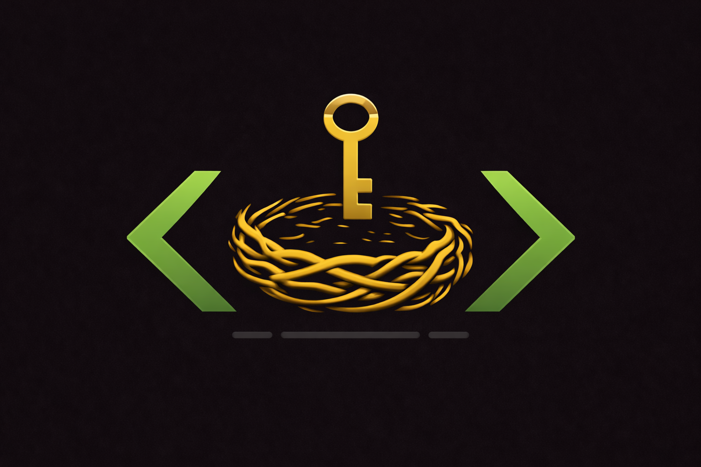

# Hort

**Local secret and config store for humans and AI agents.**

<p align="center">
  
</p>

## Why

I work with three AI coding agents daily — Claude Code, Codex, Gemini. All of them need credentials. API tokens, database passwords, tenant IDs, service URLs. Across environments. Across customers.

Here is how that works today: `.env` files scattered across projects. Environment variables that vanish between sessions. Hardcoded values in configs that shouldn't be committed. Or the agent asks you, you paste it in, it forgets, it asks again next session.

None of this is discoverable. An agent can't ask "what secrets are available?" — it has to know upfront or ask you every time. None of it is environment-aware — switching between dev and prod means manual juggling. None of it is secure — plaintext files with credentials sitting in project directories. And none of it works across agents — each tool has its own way of handling credentials, or doesn't handle them at all.

*Hort* — the Nibelungenhort, where the treasure lies — solves this. One encrypted vault, one CLI, all agents, all environments.

## Install

### npm / npx (cross-platform)

```bash
npx @s16e/hort --help       # Run without installing
npm install -g @s16e/hort   # Install globally
hort init
```

### macOS (Homebrew) — recommended

```bash
brew install sebastian-breitzke/tap/hort && hort init
```

Updates: `brew upgrade hort`

### Linux

```bash
VERSION=$(curl -fsSI -o /dev/null -w '%{redirect_url}' https://github.com/sebastian-breitzke/hort/releases/latest | grep -oE '[^/]+$') \
  && ARCH=$(uname -m | sed 's/x86_64/amd64/') \
  && curl -fsSL "https://github.com/sebastian-breitzke/hort/releases/download/${VERSION}/hort_${VERSION#v}_linux_${ARCH}.tar.gz" \
  | tar -xz -C /tmp hort \
  && sudo mv /tmp/hort /usr/local/bin/hort \
  && hort init
```

### Windows (PowerShell)

```powershell
$release = (Invoke-RestMethod -Uri "https://api.github.com/repos/sebastian-breitzke/hort/releases/latest").tag_name
$version = $release.TrimStart("v")
$url = "https://github.com/sebastian-breitzke/hort/releases/download/$release/hort_${version}_windows_amd64.zip"
Invoke-WebRequest -Uri $url -OutFile "$env:TEMP\hort.zip"
Expand-Archive -Path "$env:TEMP\hort.zip" -DestinationPath "$env:LOCALAPPDATA\hort" -Force
$env:PATH += ";$env:LOCALAPPDATA\hort"
[Environment]::SetEnvironmentVariable("PATH", "$([Environment]::GetEnvironmentVariable('PATH', 'User'));$env:LOCALAPPDATA\hort", "User")
Remove-Item "$env:TEMP\hort.zip"
Write-Host "hort installed" -ForegroundColor Green
hort init
```

### Windows (Scoop)

```powershell
scoop bucket add sebastian-breitzke https://github.com/sebastian-breitzke/scoop-bucket
scoop install hort
hort init
```

### From Source

```bash
go install github.com/sebastian-breitzke/hort/cmd/hort@latest && hort init
```

After `hort init` you'll set a passphrase — that's it. Vault created, session unlocked, ready to store secrets.

## Usage

### Getting Started

```bash
# Create your vault — you'll set a passphrase
hort init

# Store your first secret
hort --set-secret grafana-token --value "glsa_..." --description "Grafana API token"

# Use it
TOKEN=$(hort --secret grafana-token)
curl -H "Authorization: Bearer $TOKEN" https://monitoring.example.com
```

### Environments

Every entry supports environment-specific values. Without `--env`, the baseline (`*`) is used.

```bash
hort --set-secret db-password --value "dev-pass" --description "PostgreSQL password"
hort --set-secret db-password --value "prod-pass" --env prod

hort --secret db-password              # → dev-pass (baseline)
hort --secret db-password --env prod   # → prod-pass
hort --secret db-password --env staging # → dev-pass (fallback to baseline)
```

### Contexts

Secrets aren't just per-environment. They can be per-environment *and* per-context. A context is any second dimension: tenant, customer, project.

```bash
hort --set-secret tenant-id --value "default-123" --description "SimpleChain tenant ID"
hort --set-secret tenant-id --value "prod-123" --env prod
hort --set-secret tenant-id --value "heine-456" --env prod --context heine
hort --set-secret tenant-id --value "otto-789" --env prod --context otto

hort --secret tenant-id --env prod --context heine  # → heine-456
hort --secret tenant-id --env prod --context otto   # → otto-789
hort --secret tenant-id --env prod                  # → prod-123
hort --secret tenant-id --env staging               # → default-123 (fallback to *+*)
```

Fallback chain: `env+context → env+* → *+*`. Specific wins, baseline catches the rest.

### Configs

Non-sensitive values that still need environment/context awareness:

```bash
hort --set-config api-url --value "https://api.dev.example.com" --description "Base API URL"
hort --set-config api-url --value "https://api.example.com" --env prod

API_URL=$(hort --config api-url --env prod)
```

### Discovery

Agents need to know what's available. Hort makes everything discoverable:

```bash
hort --list
# config   api-url      Base API URL           [env: *, prod]
# secret   tenant-id    SimpleChain tenant ID  [env: *, prod]  [ctx: heine, otto]

hort --describe tenant-id
# Name:         tenant-id
# Type:         secret
# Description:  SimpleChain tenant ID
# Environments: *, prod
# Contexts:     heine, otto

hort --list --json   # Machine-readable output
hort --describe tenant-id --json
```

### Vault Management

```bash
hort init              # Create new vault (set passphrase)
hort init --restore    # Restore with existing passphrase on a new machine
hort unlock            # Unlock vault (passphrase → session key cached)
hort lock              # Lock vault (clear session key)
hort status            # Show vault status, entry counts
```

### Delete

```bash
hort --delete tenant-id                          # Delete entire entry
hort --delete tenant-id --env prod               # Delete prod override only
hort --delete tenant-id --env prod --context heine  # Delete specific env+context
```

### Mounted Sources

Hort supports multiple secret sources on top of the primary vault. Use `hort source mount` to register an external encrypted file (e.g. an app's instance-local secret store) as an additional source. Reads merge across every unlocked source with a `[source]` prefix; writes default to the primary vault and require `--source <name>` to target a mount.

```bash
# Register a mounted source (raw 32-byte key, no KDF)
hort source mount --name fachwerk-heine \
  --path ~/.fachwerk-heine/secrets.hort.enc \
  --key-hex "$MY_APP_MASTER_KEY_HEX"

hort source list                         # primary + all registered mounts
hort --list                              # merged entries with [mount] prefixes
hort --set-secret foo --value bar --source fachwerk-heine
hort --secret foo --source fachwerk-heine
hort source unmount --name fachwerk-heine
```

The vault file itself stays on disk between unmounts — unmount only clears the cached key and removes the registry entry. Mount names must be lowercase `a-z0-9._-`. `primary` is reserved.

### Daemon (optional)

Frequent callers (e.g. an app resolving dozens of secrets per request) can start a background daemon to avoid spawning a fresh CLI process per call:

```bash
hort daemon start        # foreground — wrap with launchd/systemd/nohup for background
hort daemon status       # is the socket responsive?
hort daemon stop         # SIGTERM the running daemon
```

When the daemon is running, every `hort --secret`/`--set-secret`/`--list` invocation detects the socket at `~/.hort/daemon.sock` and routes the request through it instead of reading the vault file directly. If the daemon is not running, the CLI transparently falls back to file access — no configuration needed.

## Agent Integration

Hort is agent-first, not agent-compatible. The `--help` output includes an `AGENT INSTRUCTIONS` section — when an agent runs `hort --help`, it learns the full interface in one call.

**How agents use Hort:**

1. `hort --list` — discover available secrets and configs
2. `hort --describe <name>` — see environments and contexts for an entry
3. `hort --secret <name>` / `hort --config <name>` — read values
4. Output is raw on stdout, no decoration — safe for `$()` and pipes
5. `--json` flag for structured output when agents prefer to parse
6. Exit code 2 = vault locked → agent asks user to run `hort unlock`

**Automation:** Set `HORT_PASSPHRASE` to skip interactive prompts (CI/CD, scripting):

```bash
export HORT_PASSPHRASE="my-passphrase"
hort init    # no terminal prompt
hort unlock  # no terminal prompt
```

## Exit Codes

| Code | Meaning |
|------|---------|
| 0 | Success |
| 1 | General error (not found, invalid args) |
| 2 | Vault is locked |

## Implementation Details

### Architecture

```
cmd/hort/main.go            CLI entry point (Cobra)
internal/
├── vault/
│   ├── crypto.go            AES-256-GCM encrypt/decrypt, Argon2id KDF, v1/v2 format parsing
│   ├── format.go            v2 header layout + KDF flag
│   ├── vault.go             VaultRef, load/save/update by ref, primary helpers
│   ├── sources.go           Mounted-source registry (~/.hort/sources/index.json)
│   ├── session.go           Per-ref session key persistence
│   └── lock.go              Per-ref flock for concurrent writers
├── store/
│   └── store.go             Multi-source merge reads, targeted writes, ambiguity detection
├── daemon/
│   ├── server.go            Unix-socket JSON-RPC-lite server
│   ├── client.go            Short-lived client with auto-detect
│   ├── protocol.go          Method names and request/response shape
│   └── paths.go             Socket / PID / log paths
└── cli/
    ├── commands.go          Command implementations (with transparent daemon routing)
    ├── daemon.go            `hort daemon start/stop/status`
    ├── help.go              Help text (doubles as agent prompt)
    └── output.go            Output formatting (plain text + JSON)
```

### Encryption

Everything lives in a single file: `~/.hort/vault.enc`.
Writes are serialized with a local file lock, and every successful update keeps the previous encrypted state in `~/.hort/vault.enc.bak`.

**File format** (binary). Two variants are supported:

v1 (legacy — only the primary vault created before multi-source support uses this):
```
[salt:32 bytes][argon2id-time:4][argon2id-memory:4][argon2id-threads:1][nonce:12][ciphertext+tag:...]
```

v2 (all new vaults incl. mounted sources):
```
[magic:"HRT\x02"][version:1 byte][kdf:1 byte][salt:32][argon-time:4][argon-memory:4][argon-threads:1][nonce:12][ciphertext+tag:...]
```

`kdf = 0` → Argon2id-derived key (salt + params are meaningful). `kdf = 1` → raw 32-byte key supplied by the mounter (salt/params fields are present but unused). Mounted sources typically use `kdf = 1` so the mounting app's own master key is used directly, no Argon2id pass.

- **Key derivation:** Argon2id (memory-hard, GPU-resistant) with 64 MB memory cost, 3 iterations, 4 threads
- **Encryption:** AES-256-GCM with authenticated encryption (tamper-proof)
- **Salt:** 32 bytes, cryptographically random, generated at vault creation
- **Nonce:** 12 bytes, fresh random nonce on every write

The header (salt + Argon2id params) is unencrypted by design — these are not secrets. The ciphertext is the AES-256-GCM sealed JSON vault body.

### Vault Structure (decrypted)

```json
{
  "version": 1,
  "secrets": {
    "tenant-id": {
      "description": "SimpleChain tenant ID",
      "values": {
        "*:*": "default-123",
        "prod:*": "prod-123",
        "prod:heine": "heine-456",
        "prod:otto": "otto-789"
      }
    }
  },
  "configs": {
    "api-url": {
      "description": "Base API URL",
      "values": {
        "*:*": "https://api.dev.example.com",
        "prod:*": "https://api.example.com"
      }
    }
  }
}
```

Values are keyed by `env:context`. `*` is the baseline for either dimension.

### Session

`hort unlock` derives the encryption key from your passphrase and caches it in `~/.hort/.session` (chmod 600, OS user-owned). The session persists until `hort lock` — no TTL, no daemon.

Subsequent CLI calls read the session key and use it to decrypt the vault on every operation. No in-memory state between calls.

### Security Model

- **Encryption:** AES-256-GCM — authenticated, tamper-proof
- **Key derivation:** Argon2id — memory-hard, resistant to GPU/ASIC attacks
- **Session key:** File-based, chmod 600, scoped to OS user
- **No network:** Zero network access, no telemetry, no cloud sync, no phone-home
- **Threat model:** Protects against other OS users and casual file access. Root access = game over — accepted for a local development tool
- **Portability:** Same passphrase decrypts the vault on any machine. Copy `vault.enc`, run `hort init --restore`

### Dependencies

| Dependency | Purpose |
|------------|---------|
| `github.com/spf13/cobra` | CLI framework |
| `golang.org/x/crypto` | Argon2id key derivation |
| `golang.org/x/term` | Terminal passphrase input (no echo) |
| Standard library | `crypto/aes`, `crypto/cipher`, `crypto/rand`, `encoding/json`, `os` |

### Cross-Platform

Single Go binary. No CGO, no system dependencies. Cross-compiles to:

- macOS (amd64, arm64)
- Linux (amd64, arm64)
- Windows (amd64)

GoReleaser builds all targets automatically on GitHub Release.

## Name

**Hort** (German, /hɔʁt/) — the Nibelungenhort, the legendary treasure hoard from Germanic mythology. Where the gold lies. Where your secrets belong.

## License

MIT
